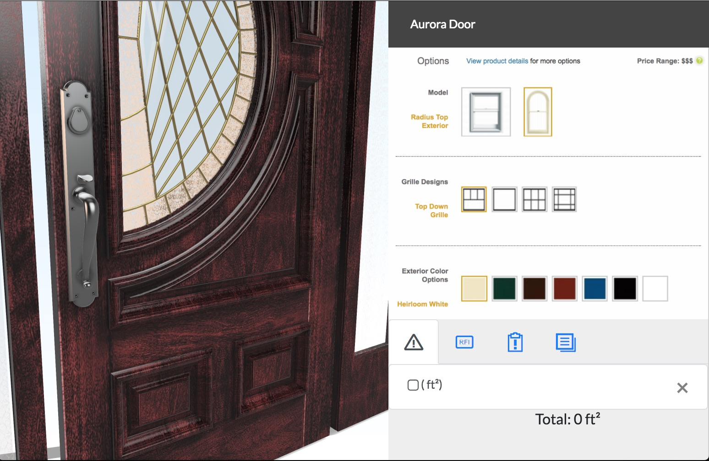

# JELDWIN-configurator

original site: [http://www.jeld-wen.com/en-us/products](http://www.jeld-wen.com/en-us/products/windows/styles/double-hung/custom-wood-double-hung-window)

LMV-DEMO: [github.io/JELDWIN-configurator](https://wallabyway.github.io/JELDWIN-configurator/) 

### Zoomed in view

### Geometry combo's:

Jeld-Wen Aurora Door / 250FlatTopCustomWoodDoor-36x80-POC

- [LMV](https://wwssrepository.autodesk360.com/g/shares/SH7f1edQT22b515c761e74c62506f9442c87)
- [configurations](https://wwssrepository.autodesk360.com/g/shares/SH7f1edQT22b515c761e74c62506f9442c87)

#### material combo's

- MahoganyGlossy
- MahoganySequoia
- CherryGlossy

### References
- [Phillips configurator](https://github.com/Autodesk-Forge/forge-rcdb.nodejs/blob/34fa81b94a400454ef48d475dd9cfe417460eff3/src/client/viewer.components/Viewer.Extensions.Dynamic/Viewing.Extension.CAT/Viewing.Extension.CAT.js)
- [prism definitions](https://git.autodesk.com/bealem/LynxSamples/tree/master/samples/PrismExample/prismData)
- [Three.js example procedural](https://git.autodesk.com/hainese/PRISM-standalone)
- [Autodesk-wiki](https://wiki.autodesk.com/display/LMVCORE/Procedural+Wood+Resource+Page)
