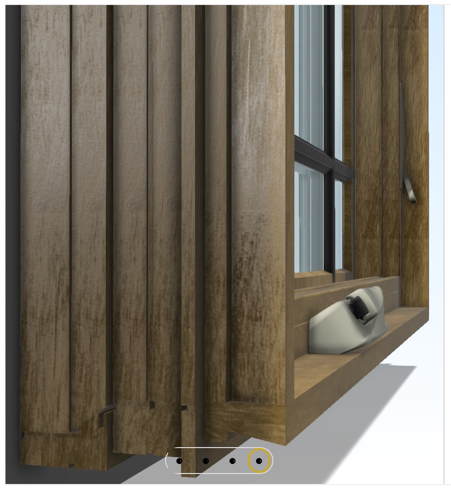
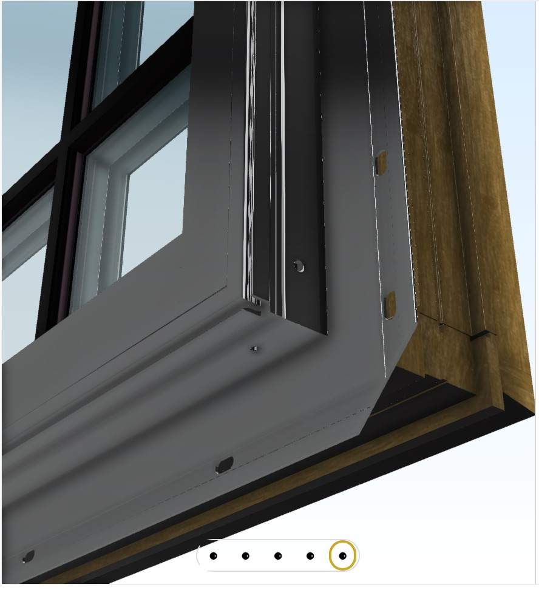
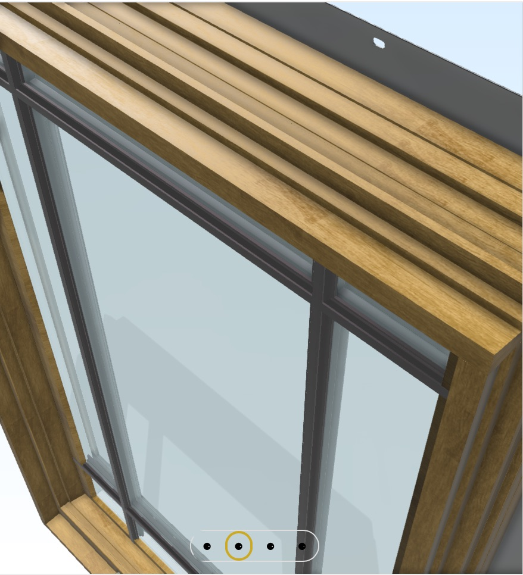
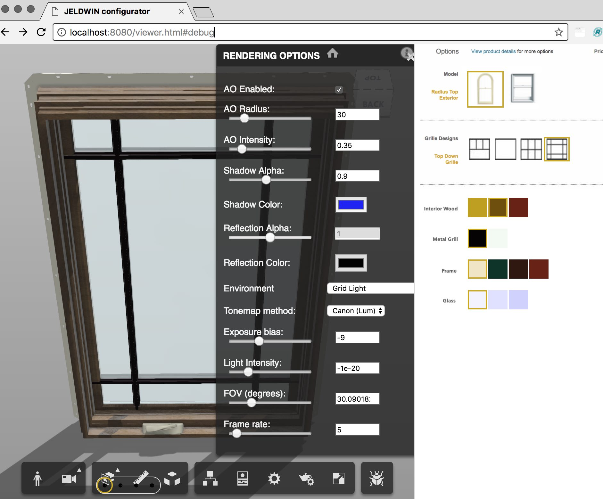

# JELDWIN-configurator

Jeld-wen Site demo: https://www.jeld-wen.com/en-us/products/windows/builders-vinyl-v-2500/double-hung

DEMO: [github.io/JELDWIN-configurator](https://wallabyway.github.io/JELDWIN-configurator/) 

-- 

-- 

### Debug mode

I’ve added a ‘debug mode’ switch that turns on the lighting debugging.

Just add ‘#debug’ to the end of the viewer.html, like this…

[https://wallabyway.github.io/JELDWIN-configurator/viewer.html#debug](https://wallabyway.github.io/JELDWIN-configurator/viewer.html#debug)

The toolbar will appear with a Utah-Teapot icon.  Click on this, and use the UI to adjust AO, environment, etc, etc.

### Combo's

##### Geometry
Jeld-Wen Aurora Door / 250FlatTopCustomWoodDoor-36x80-POC

- using [Siteline_CladCasement30X48](https://wwssrepository.autodesk360.com/g/projects/2017050374551981/data/dXJuOmFkc2sud2lwcHJvZDpmcy5mb2xkZXI6Y28uVkdSVzg2dmZRTENBbTVrVWR1QTZ3UQ) 
- [configurations](https://wwssrepository.autodesk360.com/g/shares/SH7f1edQT22b515c761e74c62506f9442c87)

##### materials

- MahoganyGlossy
- MahoganySequoia
- CherryGlossy

### References
- [JELDWIN product example](http://www.jeld-wen.com/en-us/products/windows/styles/double-hung/custom-wood-double-hung-window)

- [Philipp's CAT configurator POC](https://github.com/Autodesk-Forge/forge-rcdb.nodejs/blob/34fa81b94a400454ef48d475dd9cfe417460eff3/src/client/viewer.components/Viewer.Extensions.Dynamic/Viewing.Extension.CAT/Viewing.Extension.CAT.js)
- [git.autodesk prism definitions](https://git.autodesk.com/bealem/LynxSamples/tree/master/samples/PrismExample/prismData)
- [Eric Heinz Three.js Prism-3D-wood POC](https://git.autodesk.com/hainese/PRISM-standalone)
- [Prism-3D-wood spec - Autodesk wiki](https://wiki.autodesk.com/display/LMVCORE/Procedural+Wood+Resource+Page)
